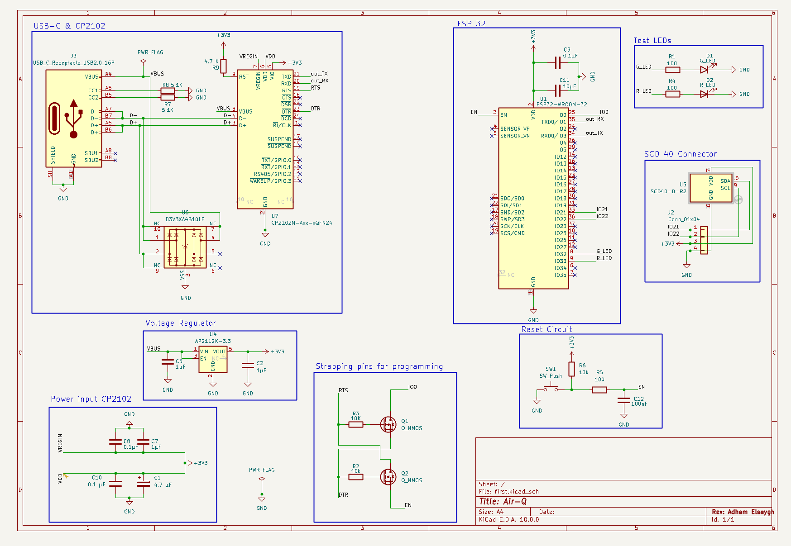

# Air_Q
# ESP32 Air Quality & Temprature Sensor

Prototype_image/Schmatic.png
An ESP32-powered environmental monitoring node and weather station built on a custom-designed PCB. This project integrates  digital sensor suites to log real-time air quality metrics, temperature, and humidity, emphasizing robust hardware design principles and clean embedded firmware.

## 🚀 Features

* **ESP32 Core:** Leverages dual-core processing and built-in Wi-Fi/Bluetooth capabilities for real-time data acquisition and telemetry.
* **Custom PCB Design:** Engineered from scratch with a focus on stable power delivery and signal integrity:
    * **USB-C Power Input:** Modern, reliable power delivery interface.
    * **Noise Mitigation:** Strategically placed decoupling capacitors to suppress high-frequency noise and ensure stable MCU and sensor operation.

---

## 🛠️ Hardware Specifications

### System Architecture
The system is built around the **ESP32-WROOM-32** module. Power is negotiated through a USB-C interface, stepped down to a clean 3.3V rail for the MCU and digital sensors

### Key Components & Design Choices
* **Microcontroller:** ESP32 (Wi-Fi & Bluetooth LE enabled)
* **Power Section:** * USB-C input with ESD protection.
    * Low-dropout (LDO) linear regulator for a stable 3.3V rail.
    * Decoupling capacitors (100nF and 10µF ceramic) placed as close as possible to the IC power pins to filter out supply ripple.
* **Sensors:**
    * **SCD-40:** Digital temperature/humidity sensor (interfaced via I2C).
    
---

---

## 💻 Software Setup & Firmware

The firmware is designed with modularity in mind, separating sensor driver logic from network telemetry functions.

* **IDE:** Arduino IDE.
* **Framework:** Arduino Core for ESP32 (portable to Zephyr RTOS / ESP-IDF).

---
(Project is still work in progress,currently working on PCB)
